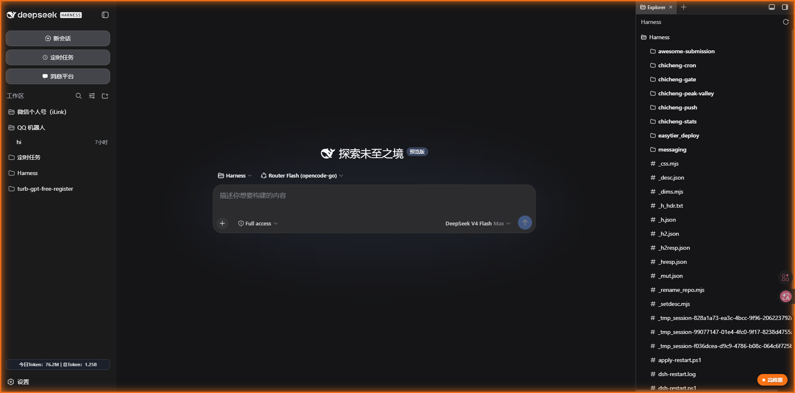
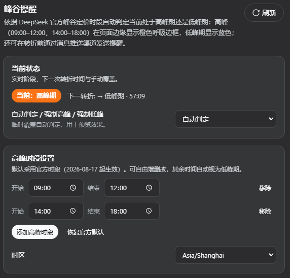
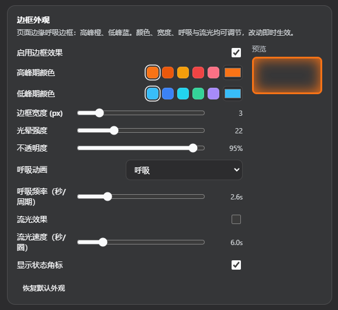
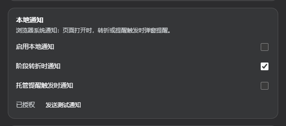
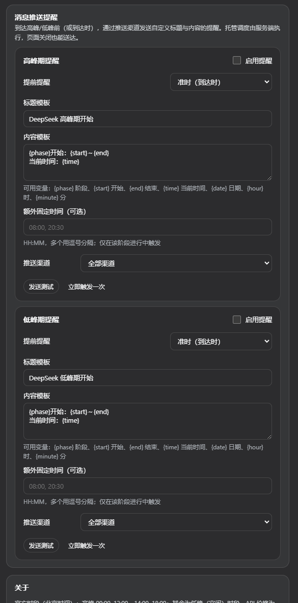

# chicheng-peak

[](LICENSE)
[](https://github.com/topics/dsh-plugin)

dsh **峰谷提醒**插件：依据 DeepSeek 官方峰谷定价时段自动判定当前处于**高峰期**还是**低峰期**，并：

- 在网页边缘渲染**贴屏呼吸边框** —— 高峰期**橙色**、低峰期**蓝色**，呼吸光晕可选择**向内/向外**，支持颜色、宽度、光晕、不透明度、呼吸频率与**流光彗星**等外观调节；
- **输入框同样带有同款边框特效**（颜色/宽度/动画与页面边缘一致，光效方向独立可选），滚动与输入法弹出时自动跟随输入框；
- 在到达高峰/低峰前（或准时到达时），通过**消息推送渠道**（chicheng-push：Server酱 / Bark / 钉钉 / 企业微信 / Telegram / 飞书 / Webhook…）或 **messaging-core 消息平台**发送**自定义标题与内容**的提醒 —— 调度在服务端执行，页面关闭也能送达；
- 支持浏览器**本地通知**（页面打开时）。

> 官方时段（北京时间，[2026-08-17 起生效](https://api-docs.deepseek.com/zh-cn/quick_start/pricing/)）：
> **高峰 09:00–12:00、14:00–18:00**；其余为低峰（空闲）时段，API 价格约为高峰一半。

## 截图

| 主页效果（高峰橙色边框） | 设置页（状态总览 / 高峰时段） | 设置页（边框外观） |
|---|---|---|
|  |  |  |

| 设置页 | 设置页 | 设置页 |
|---|---|---|
|  |  | |

## 安装

```sh
dsh plugin --profile web add D:\Harness\chicheng-peak
```

同时确认 `C:\Users\TJ\.dsh\profiles\web\package.json` 的
`dsh.profile.bundles` 已包含 `"chicheng-peak"`：

```json
"bundles": [
  "@deepseek-ai/dsh-base",
  "@deepseek-ai/dsh-web-app",
  "dsh-better-sidebar",
  "chicheng-gate",
  "dshmarket",
  "chicheng-cron",
  "chicheng-stats",
  "chicheng-push",
  "chicheng-peak",
  "messaging-core"
]
```

改完 **手动重启 dsh web 服务** 生效（client 半改动只需刷新页面）。
本地 `file:` 插件源码有改动时，先运行 `D:\Harness\relink-plugins.ps1` 保持
node_modules 指向源码。

## 使用

打开 **设置 → 峰谷提醒**（左侧导航带山峰波形图标），分六个圆角卡片分区：

| 分区 | 内容 |
|---|---|
| **当前状态** | 实时阶段徽标、下一转折倒计时、自动/强制高峰/强制低峰覆盖 |
| **高峰时段设置** | 高峰时段增删改（默认官方 09:00–12:00 / 14:00–18:00）、时区选择、恢复官方默认 |
| **边框外观** | 高峰色 / 低峰色（色板 + 取色器）、边框宽度、光晕强度、不透明度、呼吸动画（呼吸 / 常亮 / 关闭）、呼吸频率、**光效方向（向内 / 向外）**、**流光彗星** 开关与速度、状态角标、**输入框边框效果**（同款边框 + 独立光效方向）；所有调节即时预览 |
| **本地通知** | 浏览器通知开关、转折/提醒触发开关、权限申请、测试通知 |
| **消息推送提醒** | 高峰期 / 低峰期各一行：启用、**提前提醒**（0 分钟 = 准时到达时，或 5/10/15/30/60 分钟）、标题模板、内容模板、额外固定时间（HH:MM 逗号分隔）、推送渠道（全部 / 指定渠道 / 消息平台目标）、测试发送、立即触发、最近结果 |
| **关于** | 官方时段说明与配置路径 |

**模板变量**：`{phase}` 阶段、`{phaseEn}`、`{start}` 开始、`{end}` 结束、`{time}` 当前时间（HH:MM）、`{date}` 日期、`{hour}`、`{minute}`。

## 配置

存储在 `$DSH_HOME/peakvalley/config.json`（默认 `C:\Users\TJ\.dsh\peakvalley\config.json`），
修改配置热生效，无需重启。

## API（host 暴露，fenced）

全部 `POST /peakvalley/api/<method>`，仅同源 / loopback / 受信 host 可访问：

| 方法 | 说明 |
|---|---|
| `status` | 当前阶段、时区、窗口、下一转折、边缘/通知/提醒配置快照 |
| `config` | 完整配置 + 默认值 |
| `save` | 校验并持久化配置（非法字段自动钳制/忽略） |
| `reset` | `{ section: "edge" \| "windows" \| "localNotify" \| "reminders" \| "all" }` |
| `pushChannels` | 推送渠道 + 消息平台目标清单 |
| `test` | 发送测试提醒（渲染模板） |
| `fireNow` | 立即触发某阶段提醒一次 |

## 设置导航图标

设置面板左侧导航的图标映射在官方 shell
`@deepseek-ai/dsh-client-ui-settings-general/lib/client.js` 的 `navIcon(id)`，
`settings.section` 契约不支持自定义图标，因此本插件在升级 dsh 后需要重新打补丁
（本机已内置山峰波形图标分支；恢复方式与
[chicheng-push 的补丁说明](../chicheng-push/docs/panel-icon-patch.md) 相同）。

## 开发

- host 半为零第三方运行时依赖（Node 内置模块 + profile 组合服务）。
- 修改 `lib/index.js` 后需重启；修改 `lib/client.js` 后刷新页面即可。
- 测试：`node test/engine.test.mjs`（引擎/模板/校验）、
  `node test/host.smoke.mjs`（API 路由/围栏/校验）、
  `node test/client.load.mjs`（client 工厂加载）、
  `node test/client.runtime.mjs`（client 运行时执行，DOM 桩 + 真实 apply/poll）。

## License

MIT © [534119219](https://github.com/534119219)